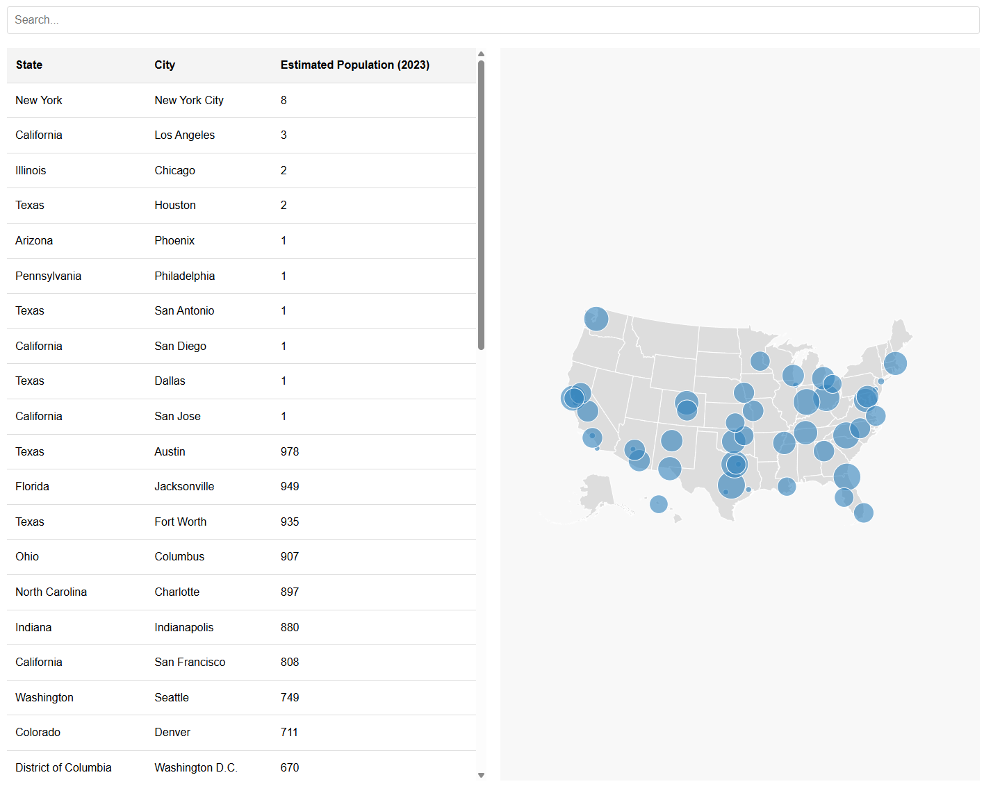

# How to Vibe Code in Cursor

This site was created with Cursor as an example of how to vibe-code a working web site using AI.

# Prerequisites
* Install Cursor, but VS Code will work using Copilot or Gemini. Cursor just does more of it for you.
* Create a repository and clone it locally.
* Open that with Cursor


# Prompts

## Gemini
Our goal is to get some test data generated for us.

* In Gemini, write: "I would like some demographics data with lat and lon so that I can show in a sample web site for my students."
* It will then generate you some random data.
* Click "Export to Sheets" and get a new spreadsheet created.
* Click "Open Sheet" to see it.
* Rename to "SampleData" and tab to "Demo1"
* File, Share, Publish to web, select "Demo1" and Comma-separated values (.csv)
* Copy the link. Mine was https://docs.google.com/spreadsheets/d/e/2PACX-1vRASvts5jgMbp0HrVI_iJNytSOjpjx_F9vHg78wyYtk6-F9SwKpk-SIN54cjObfF-KSUqbC8zBBt7-C/pub?gid=482452490&single=true&output=csv


## Cursor
Enter these prompts into the Cursor:

```
Create a static web site containing:
* index.html
* styles.css
* scripts.js

The site should read its data from https://docs.google.com/spreadsheets/d/e/2PACX-1vRASvts5jgMbp0HrVI_iJNytSOjpjx_F9vHg78wyYtk6-F9SwKpk-SIN54cjObfF-KSUqbC8zBBt7-C/pub?gid=482452490&single=true&output=csv

The header columns of this data are: Rank, City, State, Latitude, Longitude, Estimated Population (2023), Median Income (2022)

The site should show the data in a table whose columns are State, City, and Estimated Population (2023).
The table should initially be sorted by State then City, but the user can sort a column by clicking on it.
Add a search bar at the top that filters the rows.
To the right of the table, show the data in a proportional symbol map of the USA with Estimated Population 2023 as the value data.
```

## Test

* CTRL-SHIFT-P, Open Live Server
* I see that the Estimated populate column is coming back NaN. So I told cursor. It make the corrections, and I get my site.
* All is good so far, but I noticed that when I filter the rows, I want only those filtered rows to appear on the map. Again, I put that to Cursor and get the changes.
* Site works now.

# Push Changes
* Commit message "Init", Commit and Push
* Go to repo at https://github.com/PhoenixCodingAcademy/example1 to see the changes.
* Settings, Pages, Deploy from a branch, choose "main", Save
* Refresh the browser
* Visit site
* See https://phoenixcodingacademy.github.io/example1/

